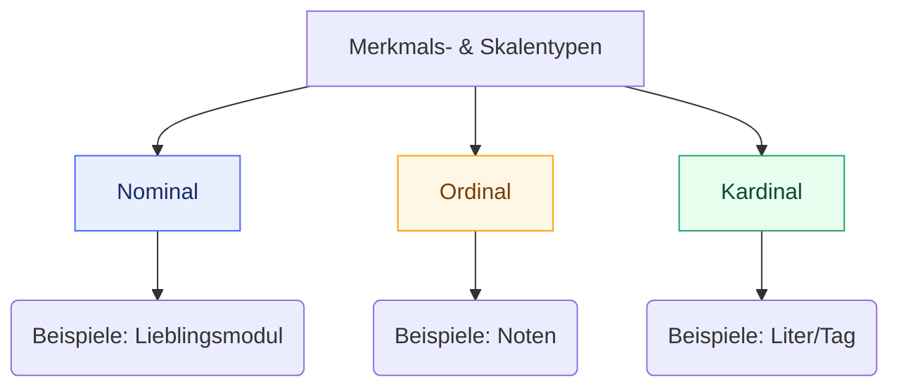

# m162

# Lernjournal Tag 1

- [GitHub Einführung](#github-einführung)
- [Markdown Tutorial](#markdown-tutorial)

## Github Einführung:
* Neues Repositorie erstellen und bennen
* Readme.md auf on stellen
* Lehrer hinzüfugen indem man den Repository Link in Teams einfügt bie **Repo Links**
* File erstellen und bennen
* Text/Code schreiben

## [Markdown Tutorial](https://www.markdowntutorial.com/de/conclusion/)

# Lernjournal Tag 2

## Datenstruktur Überblick

- [Datenstruktur](#datenstruktur)
- [Arten von Daten](#arten-von-daten)
- [Verarbeitung unstrukturierter Daten](#verarbeitung-unstrukturierter-daten)
- [Strukturierungsgrad](#strukturierungsgrad)
  
### Datenstruktur
- Objekt zur **Speicherung und Organisation von Daten**.
- Charakterisiert durch **Daten + Operationen** (Zugriff, Verwaltung).
- Viele Spezialisierungen (z. B. **B-Bäume** für Datenbanken).
- Wahl der Datenstruktur beeinflusst **Laufzeit & Speicherbedarf**.

### Arten von Daten
- **Strukturiert**: klares Schema (Tabellen, Bäume, Datenbanken).
- **Unstrukturiert**: keine feste Struktur (Texte, Audio).
- **Semi-strukturiert**: teils geordnet (z. B. E-Mail: Metadaten klar, Inhalt frei).

### Verarbeitung unstrukturierter Daten
- Erfordert **Modellierung** oder Verfahren wie:
  - **Textmining** (statistisch, NLP, maschinelles Lernen).
  - **Linguistische Methoden** (reduzieren Mehrdeutigkeit, schneller, aber menschliche Kontrolle nötig).

### Strukturierungsgrad
- **Schwach**: unsortiert, leicht einzufügen, schwer auszuwerten.  
- **Mäßig**: Tabellen/Listen, gute Auswertungen.  
- **Stark**: Datenbanken, sehr auswertbar, Einfügen aufwändig.  

> **Kernidee:** Je stärker Daten strukturiert sind, desto besser lassen sie sich **suchen und analysieren**, aber desto höher der **Aufwand bei der Pflege**.
# Statistik – Datentypen, Skalen & Häufbarkeit

Kurzüberblick über **diskrete vs. stetige Daten**, **Skalentypen** (Nominal, Ordinal, Kardinal) und **Häufbarkeit** mit Beispielen aus TBZ (Abteilung IT).

---

## Inhalt
- [Diskrete vs. Stetige Daten](#diskrete-vs-stetige-daten)
- [Skalentypen](#skalentypen)

---

## Diskrete vs. Stetige Daten

| Typ       | Definition                                                                 | Beispiel (TBZ)                                                                 |
|-----------|-----------------------------------------------------------------------------|---------------------------------------------------------------------------------|
| **Diskret**  | Werte **abzählbar** (endliche/abzählbar unendliche Anzahl von Ausprägungen) | Sie werden in einem Fragebogen an der TBZ (Abteilung IT) gefragt, welches ihr Lieblingsmodul ist. Es gibt nur eine spezifische Anzahl im Berufsbild Informatik. Die möglichen Werte sind abzählbar.           |
| **Stetig**   | Werte **nicht abzählbar** (kontinuierliche Skala)                         | Sie werden in einem Fragebogen an der TBZ (Abteilung IT) gefragt, ob sie Kommentare zu dem Modul m162 haben. Die möglichen Antworten sind nicht abzählbar, da jede Person beliebigen Text schreiben kann.

---

## Skalentypen

### Nominalskala
- **Keine Rangordnung** zwischen den Ausprägungen.
- **Beispiel**: Lieblingsmodul – alle Module sind gleichwertig.

### Ordinalskala
- **Rangordnung vorhanden**, **Abstände nicht** gleich interpretierbar.
- **Beispiel**: Schulnoten für **m162** – Note 5 > Note 4, aber der „Abstand“ 4→5 ist nicht zwingend so groß wie 5→6.

### Kardinalskala
- **Rangordnung** **und** **gleichmäßige, interpretierbare Abstände**.
- **Beispiel**: Trinkmenge pro Tag (z. B. Liter/Deziliter) – 2 L > 1 L und der Abstand 1→2 L entspricht 2→3 L.
- **Hinweis**: Noten sind **nicht kardinal**, da die „Abstände“ zwischen Noten nicht gleich groß sein müssen.

# Häufbarkeit

## Nicht häufbar
Nur eine Ausprägung möglich (z. B. Lieblingsmodul, Geschlecht).

## Häufbar
Mehrere Ausprägungen möglich (z. B. besuchte Module).

## Quellen / Weitere Infos
- [Diskrete vs. stetige Merkmale + Häufbarkeit](#)
- [Merkmalsarten & Skalentypen – 123Mathe](#)
- [Crashkurs Statistik – Video Skalentypen](#)

# Lernjournal Tag 3
  # Einfache Datentypen

## Ganze Zahlen (Integer-Typen)
- **Namen:** `INT`, `INTEGER`, `SMALLINT`, `BIGINT`, ...
- **Wertebereich:** abhängig von Bitbreite (z. B. 16, 32, 64 Bit).
- **Operationen:** Grundrechenarten, Vergleich, Division mit Rest/Modulo.

## Natürliche Zahlen (Unsigned)
- **Namen:** `UNSIGNED INT`, `CARDINAL`, `WORD`, ...
- **Wertebereich:** nur positive Zahlen, abhängig von Bitbreite.
- **Operationen:** wie bei ganzen Zahlen.

## Festkommazahlen (Dezimalzahlen)
- **Namen:** `DECIMAL`, `NUMERIC`, `CURRENCY`, ...
- **Wertebereich:** abhängig von Stellenanzahl; `CURRENCY`: sehr großer Bereich.
- **Operationen:** Grundrechenarten, Vergleich, Modulo.

## Aufzählungstypen (ENUM, SET)
- **Wertebereich:** frei definierbar (z. B. `ROT`, `BLAU`, `GELB`).
- **Operationen:** Vergleich.

## Boolean (Wahrheitswerte)
- **Namen:** `BOOL`, `BOOLEAN`, `LOGICAL`.
- **Wertebereich:** `TRUE/FALSE` oder `0/≠0`.
- **Operationen:** logische Verknüpfungen (`AND`, `OR`, `NOT`, `XOR` …).

## Zeichen (Character)
- **Namen:** `CHAR`.
- **Wertebereich:** alle Zeichen des Zeichensatzes.
- **Operationen:** Vergleich, Umwandlung in Integer.

## Gleitkommazahlen (Floating Point)
- **Namen:** `FLOAT`, `REAL`, `DOUBLE`, ...
- **Wertebereich:** je nach Genauigkeit (IEEE 754).
- **Operationen:** Grundrechenarten, Vergleich.

## Zeiger (Pointer)
- **Namen:** `POINTER`, `ACCESS`, `*`.
- **Wertebereich:** Adresse einer Speicherstelle.
- **Operationen:** Referenz, Dereferenz, Adressarithmetik (in C/C++).

## Nullzeiger
- **Namen:** `NULL`, `NIL`, `None`, `Nothing`.
- **Bedeutung:** verweist auf kein Objekt, unterscheidet sich von gültigen Pointern.

---

# Zusammengesetzte Datentypen

## Zeichenketten (Strings)
- **Feste Länge:** `CHAR(n)`
- **Variable Länge:** `VARCHAR`, `STRING`, `TEXT`
- **Operationen:** Teilstring, Länge, Konkatenation, Vergleich.

## Datum & Zeit
- **Namen:** `DATE`, `TIME`, `TIMESTAMP`.
- **Speicherung:** meist Millisekunden seit Referenzdatum.
- **Operationen:** Vergleich, Differenz, Formatierungen.

## Binäre Daten (BLOB)
- **Namen:** `BLOB`, `CLOB`.
- **Wertebereich:** Bilder, Audio, Video, beliebige Binärdaten.
- **Operationen:** Länge, Zusammensetzen, Vergleich.

## Verbund/Struktur (Record/Struct)
- **Namen:** `RECORD`, `STRUCT`, `CLASS`.
- **Wertebereich:** Kombination unterschiedlicher Datentypen.
- **Operationen:** Vergleich (abhängig von Sprache), Zuweisung.

---

# Speicherverwaltung (vereinfacht, Beispiel Java)

- **Stack:** Speicherung einfacher Datentypen (z. B. `int`, `float`).
- **Heap:** Speicherung zusammengesetzter Datentypen (z. B. Objekte, Strings).
- **Pointer/Referenzen:** zeigen im Stack auf Objekte im Heap.  
  - In **C/C++** sichtbar und nutzbar.  
  - In **Java/C#** existieren auch, sind aber „versteckt“.  

# Datenstrukturen

## Datensatz / Record / Tupel
- Enthält mehrere Werte unterschiedlicher Typen in fester Reihenfolge.  
- Kann als **Zeile einer Tabelle** gesehen werden.  
- **Beispiel:** `(ID=12, Name=Hans, Adresse=Zürcherstrasse 12)`

---

## Array
- Sammlung von Elementen **gleichen Typs** (in dynamischen Sprachen auch gemischte Typen möglich).  
- Zugriff über **Index**.  
- Kann **mehrdimensional** sein (z. B. 2D-Matrizen).  
- **Sonderform:** assoziatives Array (Dictionary) → Zugriff über Schlüssel statt Index.  
- **Beispiele:**  
  - `[12, 45, 23]`  
  - `["pos01" = "Position 01"]`

---

## Verkettete Liste
- Dynamische Speicherung beliebig vieler Objekte.  
- Jedes Element verweist auf das **nächste Element**.  
- Grundlage für komplexere Strukturen (z. B. Blockchain).  
- **Analogie:** Zug, bei dem die Wagen verbunden sind.  
- [Erklärungsvideo](https://studyflix.de/informatik/verkettete-liste-1433)

---

## Stapelspeicher / Stack
- Speicherung nach dem **LIFO-Prinzip** (Last In, First Out).  
- **Operationen:**  
  - `push` = Element einfügen  
  - `pop` = oberstes Element entfernen  
  - `peek/top` = oberstes Element lesen  
- **Analogie:** Stapel Teller oder Metro-Einstieg.  
- [Erklärungsvideo](https://studyflix.de/informatik/stacks-885)

---

## Warteschlange / Queue
- Speicherung nach dem **FIFO-Prinzip** (First In, First Out).  
- **Operationen:**  
  - `enqueue` = Element hinten einfügen  
  - `dequeue` = vorderstes Element entfernen  
- **Analogie:** Warteschlange vor einem Club.  
- [Wikipedia](https://de.wikipedia.org/wiki/Warteschlange_(Datenstruktur))

---

## Vorrangwarteschlange / Priority Queue
- Erweiterung der Queue mit **Prioritäten**.  
- Immer das **wichtigste Element** wird zuerst entfernt.  
- Häufig mit **Heaps** implementiert.  
- **Analogie:** Club-Warteschlange mit **VIP-Liste**.  
- [Wikipedia](https://de.wikipedia.org/wiki/Vorrangwarteschlange)

---

## Graph
- Sammlung von **Knoten und Kanten**.  
- Knoten können mehrere Verbindungen haben.  
- **Operationen:** Einfügen, Löschen, Suchen.  
- **Analogie:** GPS-Navigation mit vielen möglichen Wegen.  
- [Erklärungsvideo](https://studyflix.de/informatik/grundbegriffe-der-graphentheorie-1285)

---

## Baum
- Spezialform des Graphen: Jeder Knoten hat **max. einen Vorgänger** und mehrere Nachfolger.  
- **Binärbaum:** max. zwei Kinder pro Knoten.  
- **Suchbaum:** Elemente sind geordnet für schnelles Suchen.  
- **Analogie:** Stamm mit Verzweigungen.  
- [Erklärungsvideo](https://studyflix.de/informatik/binarbaum-1362)

---

## Heap
- Kombination aus **Baum** + **Priority Queue**.  
- Unterstützt: `insert`, `remove`, `extractMin`, oft auch `merge`, `changeKey`.  
- Dient meist zur **schnellen Prioritätsverwaltung**.  
- [Erklärungsvideo](https://studyflix.de/informatik/heap-1440)

---

## Hashtabelle
- Schlüssel werden über eine **Hashfunktion** direkt auf Speicheradressen abgebildet.  
- Sehr effizient für **Suchen, Einfügen und Löschen**.  
- Nachteil: keine geordnete Darstellung der Schlüssel.  
- **Analogie:** Nachschlagewerk mit direktem Zugriff.  
- [Erklärungsvideo (englisch)](https://www.youtube.com/watch?v=MfhjkfocRR0)
