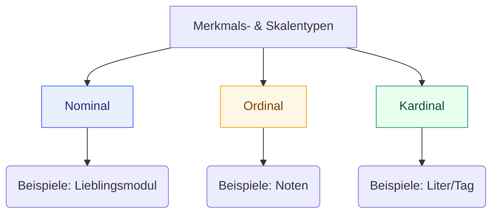
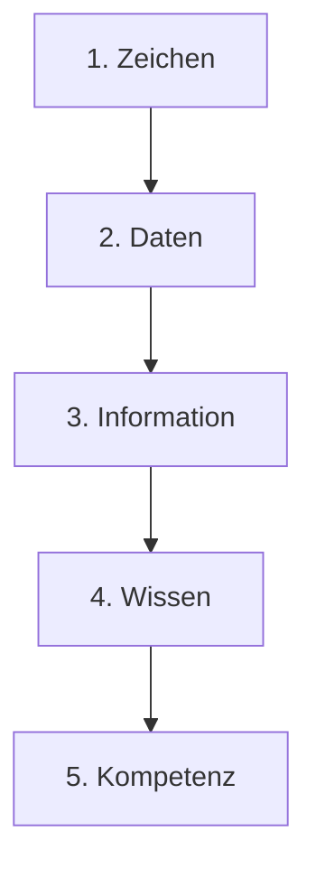
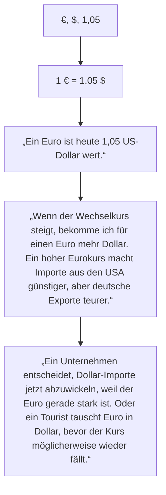

# m162

# Lernjournal Tag 1

- [GitHub Einführung](#github-einführung)
- [Markdown Tutorial](#markdown-tutorial)

## Github Einführung:
* Neues Repositorie erstellen und bennen
* Readme.md auf on stellen
* Lehrer hinzüfugen indem man den Repository Link in Teams einfügt bie **Repo Links**
* File erstellen und bennen
* Text/Code schreiben

## [Markdown Tutorial](https://www.markdowntutorial.com/de/conclusion/)

# Lernjournal Tag 2

## Datenstruktur Überblick

- [Datenstruktur](#datenstruktur)
- [Arten von Daten](#arten-von-daten)
- [Verarbeitung unstrukturierter Daten](#verarbeitung-unstrukturierter-daten)
- [Strukturierungsgrad](#strukturierungsgrad)
  
### Datenstruktur
- Objekt zur **Speicherung und Organisation von Daten**.
- Charakterisiert durch **Daten + Operationen** (Zugriff, Verwaltung).
- Viele Spezialisierungen (z. B. **B-Bäume** für Datenbanken).
- Wahl der Datenstruktur beeinflusst **Laufzeit & Speicherbedarf**.

### Arten von Daten
- **Strukturiert**: klares Schema (Tabellen, Bäume, Datenbanken).
- **Unstrukturiert**: keine feste Struktur (Texte, Audio).
- **Semi-strukturiert**: teils geordnet (z. B. E-Mail: Metadaten klar, Inhalt frei).

### Verarbeitung unstrukturierter Daten
- Erfordert **Modellierung** oder Verfahren wie:
  - **Textmining** (statistisch, NLP, maschinelles Lernen).
  - **Linguistische Methoden** (reduzieren Mehrdeutigkeit, schneller, aber menschliche Kontrolle nötig).

### Strukturierungsgrad
- **Schwach**: unsortiert, leicht einzufügen, schwer auszuwerten.  
- **Mäßig**: Tabellen/Listen, gute Auswertungen.  
- **Stark**: Datenbanken, sehr auswertbar, Einfügen aufwändig.  

> **Kernidee:** Je stärker Daten strukturiert sind, desto besser lassen sie sich **suchen und analysieren**, aber desto höher der **Aufwand bei der Pflege**.
# Statistik – Datentypen, Skalen & Häufbarkeit

Kurzüberblick über **diskrete vs. stetige Daten**, **Skalentypen** (Nominal, Ordinal, Kardinal) und **Häufbarkeit** mit Beispielen aus TBZ (Abteilung IT).

---

## Inhalt
- [Diskrete vs. Stetige Daten](#diskrete-vs-stetige-daten)
- [Skalentypen](#skalentypen)

---

## Diskrete vs. Stetige Daten

| Typ       | Definition                                                                 | Beispiel (TBZ)                                                                 |
|-----------|-----------------------------------------------------------------------------|---------------------------------------------------------------------------------|
| **Diskret**  | Werte **abzählbar** (endliche/abzählbar unendliche Anzahl von Ausprägungen) | Sie werden in einem Fragebogen an der TBZ (Abteilung IT) gefragt, welches ihr Lieblingsmodul ist. Es gibt nur eine spezifische Anzahl im Berufsbild Informatik. Die möglichen Werte sind abzählbar.           |
| **Stetig**   | Werte **nicht abzählbar** (kontinuierliche Skala)                         | Sie werden in einem Fragebogen an der TBZ (Abteilung IT) gefragt, ob sie Kommentare zu dem Modul m162 haben. Die möglichen Antworten sind nicht abzählbar, da jede Person beliebigen Text schreiben kann.

---

## Skalentypen

### Nominalskala
- **Keine Rangordnung** zwischen den Ausprägungen.
- **Beispiel**: Lieblingsmodul – alle Module sind gleichwertig.

### Ordinalskala
- **Rangordnung vorhanden**, **Abstände nicht** gleich interpretierbar.
- **Beispiel**: Schulnoten für **m162** – Note 5 > Note 4, aber der „Abstand“ 4→5 ist nicht zwingend so groß wie 5→6.

### Kardinalskala
- **Rangordnung** **und** **gleichmäßige, interpretierbare Abstände**.
- **Beispiel**: Trinkmenge pro Tag (z. B. Liter/Deziliter) – 2 L > 1 L und der Abstand 1→2 L entspricht 2→3 L.
- **Hinweis**: Noten sind **nicht kardinal**, da die „Abstände“ zwischen Noten nicht gleich groß sein müssen.


# Häufbarkeit

## Nicht häufbar
Nur eine Ausprägung möglich (z. B. Lieblingsmodul, Geschlecht).

## Häufbar
Mehrere Ausprägungen möglich (z. B. besuchte Module).

## Quellen / Weitere Infos
- [Diskrete vs. stetige Merkmale + Häufbarkeit](#)
- [Merkmalsarten & Skalentypen – 123Mathe](#)
- [Crashkurs Statistik – Video Skalentypen](#)

# Lernjournal Tag 3
  # Einfache Datentypen

## Ganze Zahlen (Integer-Typen)
- **Namen:** `INT`, `INTEGER`, `SMALLINT`, `BIGINT`, ...
- **Wertebereich:** abhängig von Bitbreite (z. B. 16, 32, 64 Bit).
- **Operationen:** Grundrechenarten, Vergleich, Division mit Rest/Modulo.

## Natürliche Zahlen (Unsigned)
- **Namen:** `UNSIGNED INT`, `CARDINAL`, `WORD`, ...
- **Wertebereich:** nur positive Zahlen, abhängig von Bitbreite.
- **Operationen:** wie bei ganzen Zahlen.

## Festkommazahlen (Dezimalzahlen)
- **Namen:** `DECIMAL`, `NUMERIC`, `CURRENCY`, ...
- **Wertebereich:** abhängig von Stellenanzahl; `CURRENCY`: sehr großer Bereich.
- **Operationen:** Grundrechenarten, Vergleich, Modulo.

## Aufzählungstypen (ENUM, SET)
- **Wertebereich:** frei definierbar (z. B. `ROT`, `BLAU`, `GELB`).
- **Operationen:** Vergleich.

## Boolean (Wahrheitswerte)
- **Namen:** `BOOL`, `BOOLEAN`, `LOGICAL`.
- **Wertebereich:** `TRUE/FALSE` oder `0/≠0`.
- **Operationen:** logische Verknüpfungen (`AND`, `OR`, `NOT`, `XOR` …).

## Zeichen (Character)
- **Namen:** `CHAR`.
- **Wertebereich:** alle Zeichen des Zeichensatzes.
- **Operationen:** Vergleich, Umwandlung in Integer.

## Gleitkommazahlen (Floating Point)
- **Namen:** `FLOAT`, `REAL`, `DOUBLE`, ...
- **Wertebereich:** je nach Genauigkeit (IEEE 754).
- **Operationen:** Grundrechenarten, Vergleich.

## Zeiger (Pointer)
- **Namen:** `POINTER`, `ACCESS`, `*`.
- **Wertebereich:** Adresse einer Speicherstelle.
- **Operationen:** Referenz, Dereferenz, Adressarithmetik (in C/C++).

## Nullzeiger
- **Namen:** `NULL`, `NIL`, `None`, `Nothing`.
- **Bedeutung:** verweist auf kein Objekt, unterscheidet sich von gültigen Pointern.

---

# Zusammengesetzte Datentypen

## Zeichenketten (Strings)
- **Feste Länge:** `CHAR(n)`
- **Variable Länge:** `VARCHAR`, `STRING`, `TEXT`
- **Operationen:** Teilstring, Länge, Konkatenation, Vergleich.

## Datum & Zeit
- **Namen:** `DATE`, `TIME`, `TIMESTAMP`.
- **Speicherung:** meist Millisekunden seit Referenzdatum.
- **Operationen:** Vergleich, Differenz, Formatierungen.

## Binäre Daten (BLOB)
- **Namen:** `BLOB`, `CLOB`.
- **Wertebereich:** Bilder, Audio, Video, beliebige Binärdaten.
- **Operationen:** Länge, Zusammensetzen, Vergleich.

## Verbund/Struktur (Record/Struct)
- **Namen:** `RECORD`, `STRUCT`, `CLASS`.
- **Wertebereich:** Kombination unterschiedlicher Datentypen.
- **Operationen:** Vergleich (abhängig von Sprache), Zuweisung.

---

# Speicherverwaltung (vereinfacht, Beispiel Java)

- **Stack:** Speicherung einfacher Datentypen (z. B. `int`, `float`).
- **Heap:** Speicherung zusammengesetzter Datentypen (z. B. Objekte, Strings).
- **Pointer/Referenzen:** zeigen im Stack auf Objekte im Heap.  
  - In **C/C++** sichtbar und nutzbar.  
  - In **Java/C#** existieren auch, sind aber „versteckt“.  

# Datenstrukturen

## Datensatz / Record / Tupel
- Enthält mehrere Werte unterschiedlicher Typen in fester Reihenfolge.  
- Kann als **Zeile einer Tabelle** gesehen werden.  
- **Beispiel:** `(ID=12, Name=Hans, Adresse=Zürcherstrasse 12)`

---

## Array
- Sammlung von Elementen **gleichen Typs** (in dynamischen Sprachen auch gemischte Typen möglich).  
- Zugriff über **Index**.  
- Kann **mehrdimensional** sein (z. B. 2D-Matrizen).  
- **Sonderform:** assoziatives Array (Dictionary) → Zugriff über Schlüssel statt Index.  
- **Beispiele:**  
  - `[12, 45, 23]`  
  - `["pos01" = "Position 01"]`

---

## Verkettete Liste
- Dynamische Speicherung beliebig vieler Objekte.  
- Jedes Element verweist auf das **nächste Element**.  
- Grundlage für komplexere Strukturen (z. B. Blockchain).  
- **Analogie:** Zug, bei dem die Wagen verbunden sind.  
- [Erklärungsvideo](https://studyflix.de/informatik/verkettete-liste-1433)

---

## Stapelspeicher / Stack
- Speicherung nach dem **LIFO-Prinzip** (Last In, First Out).  
- **Operationen:**  
  - `push` = Element einfügen  
  - `pop` = oberstes Element entfernen  
  - `peek/top` = oberstes Element lesen  
- **Analogie:** Stapel Teller oder Metro-Einstieg.  
- [Erklärungsvideo](https://studyflix.de/informatik/stacks-885)

---

## Warteschlange / Queue
- Speicherung nach dem **FIFO-Prinzip** (First In, First Out).  
- **Operationen:**  
  - `enqueue` = Element hinten einfügen  
  - `dequeue` = vorderstes Element entfernen  
- **Analogie:** Warteschlange vor einem Club.  
- [Wikipedia](https://de.wikipedia.org/wiki/Warteschlange_(Datenstruktur))

---

## Vorrangwarteschlange / Priority Queue
- Erweiterung der Queue mit **Prioritäten**.  
- Immer das **wichtigste Element** wird zuerst entfernt.  
- Häufig mit **Heaps** implementiert.  
- **Analogie:** Club-Warteschlange mit **VIP-Liste**.  
- [Wikipedia](https://de.wikipedia.org/wiki/Vorrangwarteschlange)

---

## Graph
- Sammlung von **Knoten und Kanten**.  
- Knoten können mehrere Verbindungen haben.  
- **Operationen:** Einfügen, Löschen, Suchen.  
- **Analogie:** GPS-Navigation mit vielen möglichen Wegen.  
- [Erklärungsvideo](https://studyflix.de/informatik/grundbegriffe-der-graphentheorie-1285)

---

## Baum
- Spezialform des Graphen: Jeder Knoten hat **max. einen Vorgänger** und mehrere Nachfolger.  
- **Binärbaum:** max. zwei Kinder pro Knoten.  
- **Suchbaum:** Elemente sind geordnet für schnelles Suchen.  
- **Analogie:** Stamm mit Verzweigungen.  
- [Erklärungsvideo](https://studyflix.de/informatik/binarbaum-1362)

---

## Heap
- Kombination aus **Baum** + **Priority Queue**.  
- Unterstützt: `insert`, `remove`, `extractMin`, oft auch `merge`, `changeKey`.  
- Dient meist zur **schnellen Prioritätsverwaltung**.  
- [Erklärungsvideo](https://studyflix.de/informatik/heap-1440)

---

## Hashtabelle
- Schlüssel werden über eine **Hashfunktion** direkt auf Speicheradressen abgebildet.  
- Sehr effizient für **Suchen, Einfügen und Löschen**.  
- Nachteil: keine geordnete Darstellung der Schlüssel.  
- **Analogie:** Nachschlagewerk mit direktem Zugriff.  
- [Erklärungsvideo (englisch)](https://www.youtube.com/watch?v=MfhjkfocRR0)

# Lernjournal Tag 4
# JSON – Kurzüberblick

## Was ist JSON?
- **JSON = JavaScript Object Notation**  
- Textformat zum **Speichern und Austauschen von Daten**  
- **Sprachunabhängig**, basiert aber auf JavaScript-Syntax  
---

## Eigenschaften
- Daten werden als **Name/Wert-Paare** gespeichert  
  Beispiel: "firstName":"Philippe"  
- **Objekte** → geschweifte Klammern { "key":"value" }  
- **Arrays** → eckige Klammern [...]  
- Werte können sein: String, Number, Boolean, null, Array, Object  

---

## Vorteile
- **Einfach** zu lesen und zu schreiben  
- **Leicht übertragbar** auf Javascript
- **Textbasiert**, daher in fast allen Sprachen nutzbar  

---

## JSON in JavaScript
- JSON → Objekt: `JSON.parse(text)`  
- Objekt → JSON: `JSON.stringify(obj)`  

### Beispiel
```js
{
[
"Vorname": "Lara", 
"Nachname": "Meier",
"Strasse: "Sonnenweg 12",
"Ort": "Luzern",
"Geburtsdatum": "1995-03-14",
"Hobbies: ["Wandern","Lesen"],
]
},
```
# Wissenstreppe
# Wissenstreppe: Wechselkurs





.

# Lernjournal Tag 5

# Theorie Datenmodellierung – Zusammenfassung

## 1. Grundlagen: ERD und ERM
- **ERM (Entity-Relationship-Model):** Gesamtes Modell, Sammlung von Diagrammen, kann Metadaten enthalten.  
- **ERD (Entity-Relationship-Diagram):** Einzelnes Diagramm, zeigt Entitäten und deren Beziehungen.  
- **Entität:** Objekt mit Attributen (z. B. „Mitarbeiter“ mit Vorname, Nachname …).  
- **Beziehung / Assoziation:** Verbindung zwischen Entitäten, mit **Kardinalitäten** spezifiziert.  

---

## 2. Beziehungen und Kardinalitäten
- **Kardinalitäten:** geben an, wie viele Entitäten miteinander verknüpft sind:  
  - `1` = genau eine  
  - `c` = null oder eine  
  - `m oder n` = mindestens eine  
  - `mc` = null, eine oder mehrere  

- **Beziehungstypen:**  
  - Hierarchisch  
  - Konditionell  
  - Netzwerkförmig  

---

## 3. Redundanzen & Anomalien
- **Redundanz:** Mehrfach gespeicherte Daten → fehleranfällig.  
- **Anomalien:**  
  - **Einfüge-Anomalie** → neue Daten können nicht eingefügt werden.  
  - **Änderungs-Anomalie** → gleiche Info mehrfach vorhanden, Änderungen inkonsistent.  
  - **Lösch-Anomalie** → Löschung entfernt auch wichtige Daten unbeabsichtigt.  

---

## 4. Modellarten
- **Konzeptionelles Modell:**  
  - Grundkonzept, Entitäten evtl. ohne Attribute, m(c):m(c) erlaubt.  
- **Logisches Modell:**  
  - Attribute, PK/FK, nur umsetzbare Beziehungen, DBMS-neutral.  
- **Physisches Modell:**  
  - DBMS-spezifische Datentypen, Tabellenstruktur, Constraints.  

---

## 5. Vom Konzeptionellen zum Logischen Modell
- **Primärschlüssel (PK):** Eindeutige Identifikation pro Entität.  
- **Fremdschlüssel (FK):** Referenziert PK einer anderen Tabelle.  
- **Auflösung m(c):m(c):** Einführung von Zwischentabellen (assoziative Entitäten).  

### Umwandlungsprozesse
- **Variante 1:** PK → Auflösung m:n → FK → restliche Attribute.  
- **Variante 2:** m:n → PK → FK → restliche Attribute.  

---

## 6. Vom Logischen zum Physischen Modell
- Entitäten → Tabellen.  
- **Begriffe:**  
  - Tabelle (Entität), Spalte (Attribut), Datensatz (Row), Feld (Value).  
- **DBMS-spezifische Eigenschaften:**  
  - Datentypen (z. B. `varchar`, `int`).  
  - **PK:** Primary Key  
  - **FK:** Foreign Key  
  - **NN:** Not Null (→ Unterschied zwischen `1` und `c`)  
  - **UQ:** Unique  

- In Praxis meist als **1:N** bezeichnet (entspricht 1:m oder c:m).  

---

## 7. Normalformen
- **1NF:** Atomare Werte, keine Mehrfachattribute.  
- **2NF:** 1NF + keine partiellen Abhängigkeiten vom PK.  
- **3NF:** 2NF + keine transitiven Abhängigkeiten.  

---

## 8. Datenkonsistenz & -integrität
- **Konsistenz:** Widerspruchsfreie Daten (z. B. keine doppelten Adressen).  
- **Integrität:** Regeln zur Sicherstellung korrekter Daten:  
  - **Referenzielle Integrität:** FK muss auf existierenden PK zeigen.  
  - **Constraints:** PK, FK, Unique, Not Null.  

---
# Lernjournal Tag 6

## Prüfungs fehler

- Um einen sinnvolle Information zu können braucht es einen definierten Zeichensatz.(z.B. UTF-8)
- Ordnen gegebenen Daten den korrekten Strukturen zu.
- JSON Stuktur machen.
- Ordne den Literale den Datentypen zu.

## ERM

- **Entität** → ein "Ding" oder Objekt, das man in der Datenbank beschreiben will  
  *Beispiel:* Schüler, Auto, Buch  

- **Attribut** → eine Eigenschaft dieser Entität  
  *Beispiel:* Name, Geburtsdatum, Farbe  

- **Beziehung** → Verknüpfung zwischen zwei (oder mehr) Entitäten  
  *Beispiel:* Schüler **besucht** Schule, Autor **schreibt** Buch

## Normalisierung

### Normalformen

1. **1. Normalform (1NF)**
   - Mach atomar/elementar (keine Listen oder Mehrfachwerte in einer Zelle).

2. **2. Normalform (2NF)**
   - Wenn 1NF.
   - Aufgeteilt in logische Gruppen

3. **3. Normalform (3NF)**
   - Wenn 2NF.
   - Keine transitiven Abhängigkeiten (Nicht-Schlüssel-Attribute hängen nicht von anderen Nicht-Schlüssel-Attributen ab).


### Beispiel: Student belegt Kurs

#### Unnormalisiert
| StudentID | Name      | Kurse             | Dozent       |
|-----------|-----------|-------------------|--------------|
| 1         | Anna Meier| Mathe, Informatik | Müller, Koch |

---

#### 1. Normalform (1NF)
- Kurse und Dozenten werden **atomar** gespeichert.

| StudentID | Name       | Kurs        | Dozent  |
|-----------|------------|-------------|---------|
| 1         | Anna Meier | Mathe       | Müller  |
| 1         | Anna Meier | Informatik  | Koch    |

---

#### 2. Normalform (2NF)
- Trennung, damit **Nicht-Schlüssel-Attribute** nicht nur teilweise vom Schlüssel abhängen.  
- Aufteilung in zwei Tabellen: Studenten und Belegungen.

**Student**  
| StudentID | Name       |
|-----------|------------|
| 1         | Anna Meier |

**Belegung**  
| StudentID | Kurs       | Dozent  |
|-----------|------------|---------|
| 1         | Mathe      | Müller  |
| 1         | Informatik | Koch    |

---

#### 3. Normalform (3NF)
- Dozent hängt vom Kurs ab → also in eigene Tabelle auslagern.

**Student**  
| StudentID | Name       |
|-----------|------------|
| 1         | Anna Meier |

**Kurs**  
| Kurs       | Dozent  |
|------------|---------|
| Mathe      | Müller  |
| Informatik | Koch    |

**Belegung**  
| StudentID | Kurs       |
|-----------|------------|
| 1         | Mathe      |
| 1         | Informatik |

# Zusammenfassung: ERM & ERD

## 1. Grundbegriffe
- **ERD (Entity-Relationship Diagram)**
  - Einzelnes Diagramm mit Entitäten, Attributen und Beziehungen.
- **ERM (Entity-Relationship Model)**
  - Sammlung von ERDs, ggf. mit Metadaten.
- In der Praxis oft synonym verwendet.

---

## 2. Entitäten & Beziehungen
- **Entität**: Objekt mit Attributen (z. B. „Lehrperson“ mit Vorname, Nachname, Alter).  
  → Wird später zur Tabelle.
- **Beziehung/Assoziation**: Verbindung zwischen Entitäten (Linien).
- **Kardinalität**: Gibt an, wie viele Datensätze verbunden sein können.

### Kardinalitätstypen
- **1** = genau ein Datensatz  
- **c** = kein oder genau ein Datensatz  
- **m** = mindestens ein Datensatz  
- **mc** = beliebig viele Datensätze  

### Beziehungstypen
- **Hierarchisch** (1:m)  
- **Konditionell**  
- **Netzwerkförmig (m:n)**  

---

## 3. Redundanzen & Anomalien
- **Redundanz** = mehrfache Speicherung → fehleranfällig

### Anomalien
- **Einfüge-Anomalie**: Keine neuen Daten wegen PK-Konflikt  
- **Änderungs-Anomalie**: Änderung nur an einem Vorkommen → Inkonsistenz  
- **Lösch-Anomalie**: Löschen entfernt ungewollt zusätzliche Daten  

---

## 4. Datenmodelle
### a) Konzeptionelles Modell
- Abstraktes Grundkonzept  
- Entitäten & Beziehungen (wenige oder keine Attribute)  
- m:n-Beziehungen erlaubt  

### b) Logisches Modell
- DBMS-unabhängig, aber tabellenorientiert  
- Attribute, PK & FK definiert  
- m:n-Beziehungen → durch **Zwischentabellen** (Transformationstabellen) auflösen  

### c) Physisches Modell
- DBMS-spezifisch  
- Konkrete Datentypen (z. B. VARCHAR, INT)  
- Regeln wie PK, FK, Not Null (NN), Unique (UQ)  
- Begriffe: Tabelle, Spalte, Datensatz, Feld  

---

## 5. Schlüssel
- **Primärschlüssel (PK)**: Eindeutige Identifikation eines Datensatzes  
- **Fremdschlüssel (FK)**: Verweist auf PK einer anderen Tabelle, definiert Beziehungen  

---

## 6. Vom ERD zum physischen Modell
1. Primärschlüssel hinzufügen  
2. m:n-Beziehungen mit Zwischentabellen auflösen  
3. Fremdschlüssel einfügen  
4. Attribute hinzufügen  
5. Im physischen Modell DBMS-spezifische Typen wählen  

---

## 7. Normalformen
- **1NF**: Keine mehrfachen Werte, nur atomare Attribute, so klein wie möglich 
- **2NF**: wenn 1NF, Jedes Nichtschlüsselattribut hängt vom ganzen PK ab, in logische Gruppen aufteilen  
- **3NF**: wenn 2NF Keine transitiven Abhängigkeiten, keine abhängigkeit in der Tabelle z.B. Postleitzahl und Wohnort separat in neue Tabellel

---

## 8. Datenkonsistenz & Integrität
- **Datenkonsistenz** = Widerspruchsfreiheit  
- **Referenzielle Integrität** = Ein FK muss auf einen existierenden PK zeigen  
- DBMS verhindert unzulässige Verknüpfungen automatisch  

---

### Reverse Engineering ist einfach von einem Produkt zurück zur Planung.

## ACID Modell
- Atomicity
- Consistency 
- Isolation
- Durability
